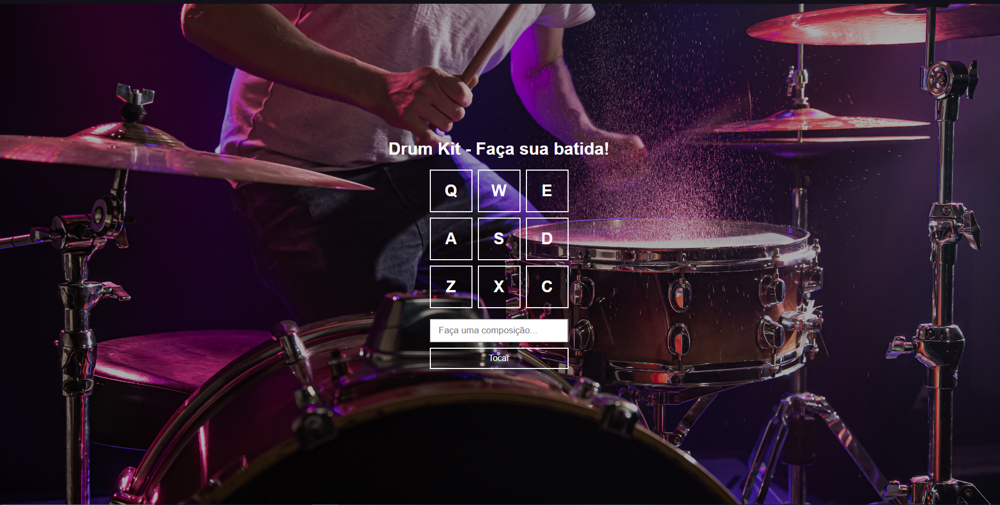

# Drum Kit 🥁



<p align="center">
  
  
  
</p>

🇧🇷 Você não fala inglês? [Clique aqui](README.pt.md) para ler a versão em português.

## 🚀 About the Project

The Drum Kit is a simple but effective web application that showcases the practical application of HTML, CSS and JavaScript. It allows you to create simple rhythmic beats by simulating a drum. This project was developed during B7Web's "7 Projects in 7 Days Challenge" Immersion.

## 🛠️ Technologies Used

- HTML
- CSS
- JavaScript

## ⚙️ Installation and Use

To install and use this project, follow these steps:

1. Clone this repository on your local machine
```bash
git clone https://github.com/artur-duart/drumkit
```
2. Navigate to the main folder of the project
```bash
cd drumkit
```
3. Open the `index.html` file in your browser

Now you can access the project in your browser.

## 🤝 Contributing

Contributions are always welcome! If you have any suggestions or corrections, feel free to open an issue or submit a pull request.

## 📝 License

This project is licensed under the MIT License. See the [LICENSE](LICENSE) file for more details.

---

Made with 💜 by <a href="https://www.linkedin.com/in/artur-duart/">Artur Duarte</a> :wave:
